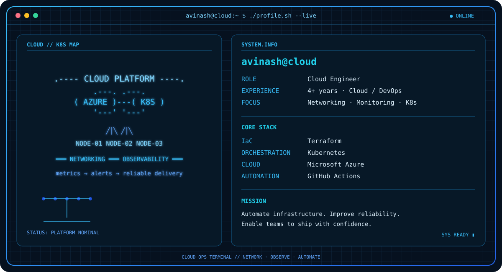

  

  
  
  

  

## Live contribution calendar

  

## Featured projects

| Project | Focus |
| --- | --- |
| [Terraform](https://github.com/guycalledavinash/terraform) | Infrastructure as Code with Terraform. |
| [CI/CD](https://github.com/guycalledavinash/ci-cd) | Continuous integration and delivery automation. |

  theme_02 // cloud-ops-terminal

